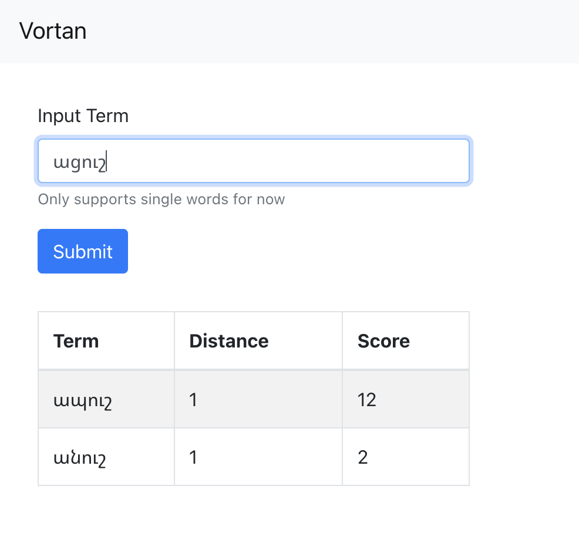

# vortan_demo_site

Site to demo spellchecker.



## Run

Frontent
```
cd frontend
npm run start
```

Backend
See [vortan_spellcheck/api](https://github.com/datapoint-armenia/vortan_spellcheck#usage)

## Resources

- https://testdriven.io/blog/fastapi-react/
